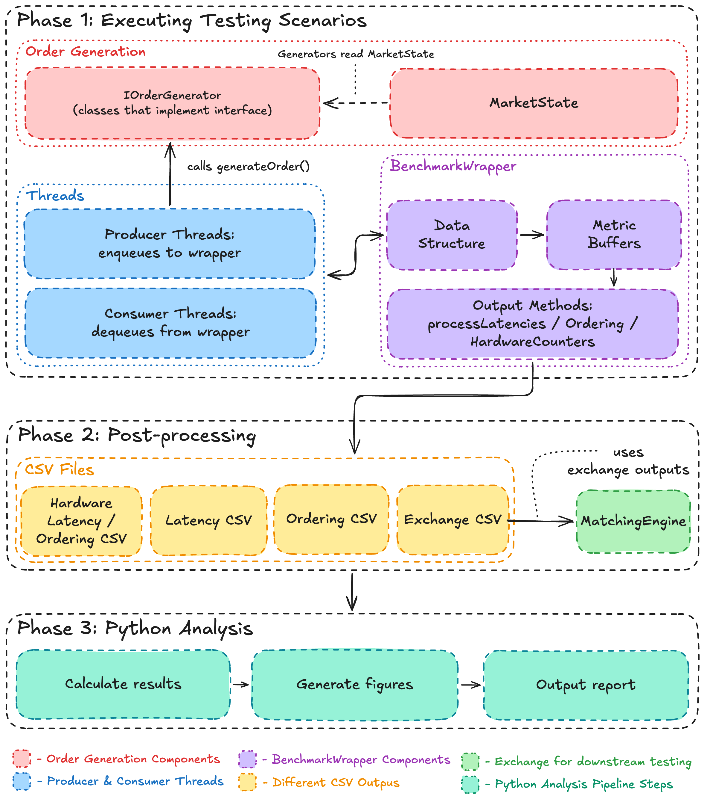

# Framework Documentation

This directory contains reference documentation for the lock-free data-structure benchmarking framework. It is split into two parts:

- [`cpp.md`](cpp.md) - the C++ benchmarking core (data structures, scenarios, benchmarking harness, hardware logging)
- [`python.md`](python.md) - the Python analysis pipeline (plotting, report generation, cross-run comparison, image editing)

For a quickstart aimed at running the framework end-to-end, see the **Supervisor Instructions** section in the top-level [`README.md`](../README.md).

## High-level architecture

The framework is split across three phases: a C++ execution phase that drives producer/consumer threads through the selected data structure, a post-processing phase that emits one CSV per metric category, and a Python analysis phase that turns those CSVs into an HTML report.

The C++ side produces tagged CSV files under `results/`. The Python side consumes those CSVs, groups them by `run_id`, and produces either per-plot images or a single aggregated HTML report.