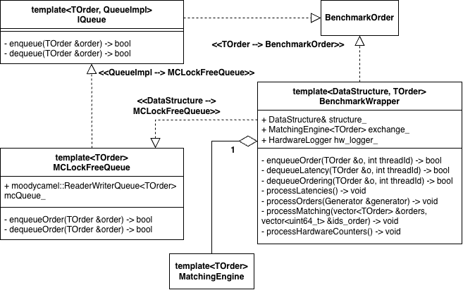
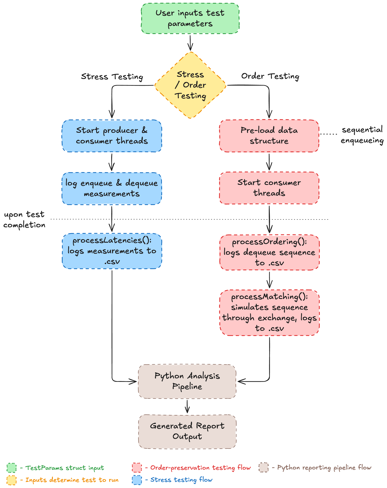

# C++ Framework

The C++ side of the project does three things: it owns the data structures under test, it drives them with realistic-ish exchange traffic, and it dumps measurements to CSV for the Python pipeline to pick up. This document is a tour of how that's wired together.

## Layout

Headers live under `include/`, implementations under `src/`, and the two trees mirror each other:

```
include/
  benchmarking/        BenchmarkWrapper template
  data_structures/
    queues/            IQueue interface + queue implementations
    ring_buffers/      IRing interface + ring buffer implementations
  exchange/            Matching engine, order book, price levels
  hardware_logging/    PAPI counter wrappers
  order_simulation/    Synthetic order generators
  scenarios/           Stress / order scenario drivers and CLI parsing
  utils/               Timing, threading, file and struct helpers

src/
  main.cpp                        Entry point and data structure selection
  benchmarking/cpp/benchmark.cpp  Explicit BenchmarkWrapper instantiations
  data_structures/                Queue / ring implementations
  exchange/                       Matching engine
  hardware_logging/               PAPI wrapper
  order_simulation/               Order generators
  scenarios/                      CLI parsing (test_inputs)
  utils/                          Timing / threading / file helpers
```

## main.cpp

`main.cpp` is intentionally small. It parses arguments into a `TestParams`, picks a ring-buffer capacity based on the workload, and constructs a `BenchmarkWrapper` around exactly one of the six candidate data structures. The six candidates are arranged as mutually-exclusive blocks under a "DATA STRUCTURE SELECTION" banner — to switch which one is benchmarked, comment the active block out and uncomment the one you want, then rebuild. Once the wrapper exists, `main` just dispatches into either the stress or the order scenario and exits.

## BenchmarkWrapper

`BenchmarkWrapper<TDS, TOrder>` (in `include/benchmarking/benchmark.hpp`) is the heart of the framework. It is templated on both the data structure type and the order type, so any class implementing `IQueue` or `IRing` slots in without modification.



The wrapper handles everything around the hot path: it tracks producer and consumer thread IDs so per-thread metrics make sense, takes nanosecond timestamps either side of every enqueue and dequeue, attaches sequence numbers so the Python side can reason about FIFO ordering, runs orders through the matching engine when the order scenario asks it to, and wraps each measured region in start/stop calls to `HardwareLogger`. When a scenario finishes the wrapper writes one CSV per metric category into `results/`, tagged with the run ID and timestamp that `run.sh` passed in.

Because every supported data structure needs its own template instantiation, those instantiations are collected at the bottom of `src/benchmarking/cpp/benchmark.cpp`. Adding a new data structure means adding one more `template class BenchmarkWrapper<...>;` line there.

## Data structures

There are two interfaces, `IQueue<TOrder, Derived>` for queue-style structures and `IRing<TOrder, Derived>` for bounded ring buffers. Both are CRTP, so calls from the wrapper into the data structure are statically dispatched and the harness contributes no virtual-call overhead to the measurements. The contract for both interfaces is the same five operations:

```cpp
auto enqueueOrder(TOrder &order) -> bool;
auto dequeueOrder(TOrder &order) -> bool;
auto getSize()                   -> uint64_t;
auto isEmpty()                   -> bool;
auto getFront(TOrder &order)     -> bool;
```

The recipe for adding a new data structure lives in the top-level README under "Adding your own Lock-free Data Structure".

## Scenarios

There are two scenarios, `stress` and `order`, defined under `include/scenarios/`. Stress just hammers the data structure with as many enqueue/dequeue operations as the configured thread count and order count permit; it produces latency and hardware CSVs. Order is the more interesting one — it drives a mixed workload through the matching engine, checks per-item ordering, and emits ordering, exchange and hardware CSVs.

CLI parsing lives in `scenarios/test_inputs.hpp`. It populates a `TestParams` from `argv`, including the positional `mode / threads / orders` arguments and the optional `--seed` and `--run-id` flags that `run.sh` always supplies.

## Order simulation

The synthetic order flow lives under `include/order_simulation/`. Each generator implements `IOrderGenerator`, and `collection_order_generator` multiplexes across several sub-generators (random, momentum, mean-reverting, market maker) using a shared `MarketState` so the resulting traffic looks roughly like real exchange flow rather than uniform noise. `BenchmarkOrder` is the POD passed through the data structures; everything in the C++ side is templated over it.

## Exchange

`include/exchange/` contains a small limit-order-book matching engine. It is deliberately not a full exchange — it just consumes orders from the data structure, updates the price book and per-level state, and emits a trades cycle that the wrapper writes out to the exchange CSV. The Python side then compares those trades against the expected trades for the input sequence.

## Hardware logging

`HardwareLogger` is a thin wrapper over PAPI for collecting cycles, instructions retired, L1/L2 cache misses and branch mispredictions. `thread_counter` keeps the counters per-thread, which is what lets the hardware CSV distinguish producer behaviour from consumer behaviour. `hardware_metrics` defines the schema that ends up as the CSV header.

## Utilities

The `utils/` directory is where the smaller helpers live. `timing.hpp` exposes nanosecond clocks and RDTSC; `threads.hpp` handles thread pinning; `files.hpp` knows how to build the `<category>_<run_id>_<timestamp>.csv` filenames the Python side expects; `structs.hpp` holds shared PODs; `counter.hpp` has a couple of small atomic counters.

## Build

Building is one command via CMake + Ninja:

```bash
./compile.sh
```

The result is a single executable at `build/lock_free_data_structures` which `run.sh` invokes with the appropriate flags.

## End-to-end flow

From a single `./run.sh` invocation, here is what happens:



`run.sh` generates a random run ID and launches the executable with the parsed arguments and `--run-id <RUN_ID>`. `main.cpp` constructs the chosen data structure plus a wrapper around it, then hands control to the stress or order scenario. The scenario drives the wrapper; the wrapper accumulates latency, ordering and hardware counter samples in memory. When the scenario finishes the wrapper writes one CSV per category into the right subdirectory of `results/`. From there the Python pipeline (covered in [`python.md`](python.md)) picks the CSVs up by run ID and turns them into plots or an aggregated HTML report.